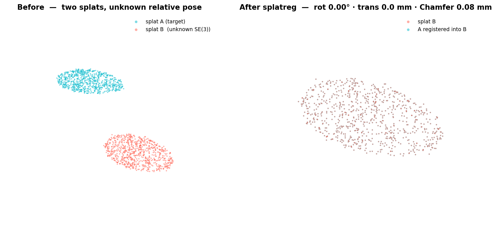

<div align="center">


# splatreg

### Register Gaussian splats — align & merge two 3DGS scans into one SE(3)/Sim(3) frame.

*The inverse of [gsplat](https://github.com/nerfstudio-project/gsplat): gsplat **renders** Gaussians, splatreg **registers** against them.* Pure PyTorch — no meshing, no CUDA extension, no point-cloud detour.

[](https://pypi.org/project/splatreg/)
[](LICENSE)
[](pyproject.toml)
[](https://github.com/nerfstudio-project/gsplat)



</div>

---

## What it is

A 3D Gaussian Splat is a cloud of oriented Gaussians that already traces an object's surface. **splatreg takes two such splats and finds the rigid (SE(3)) or similarity (Sim(3), +scale) transform that aligns them** — then optionally merges + dedupes them into one. It is the missing *registration* half of the Gaussian-splatting toolchain — the splat-to-splat alignment SuperSplat / INRIA / geospatial users keep asking for, where today's tooling punts to a manual gizmo.

The pipeline is two stages:


1. **Global init** — a coarse pose from a dense super-Fibonacci rotation sweep + batched trimmed ICP (no local-minimum trap), with optional **FPFH+RANSAC** and **learned** (GeoTransformer) seeds for harder real scans.
2. **Refinement** — a from-scratch **Levenberg–Marquardt** core over a stack of residuals: classic **ICP** (point-to-point / point-to-plane) *and* splatreg's flagship **Gaussian-SDF** residual, solving the full SE(3) or Sim(3) tangent.

It **composes, it doesn't compete**: bring gsplat tensors directly; the LM loop and residual stack are pluggable.

### The differentiator — the Gaussian-SDF residual

No competitor packages this. splatreg derives a smooth, queryable **signed-distance field directly from the target Gaussians** — no mesh, no marching cubes — and drives registration by it:

```
w_i(p) = exp(−‖p − q_i‖² / 2σ²)              # Gaussian kernel weight per anchor
q̃(p)   = Σ w_i q_i / Σ w_i                    # kernel-weighted centroid
ñ(p)   = Σ w_i n_i / ‖Σ w_i n_i‖              # kernel-weighted surface normal
d(p)   = (p − q̃(p)) · ñ(p)                    # signed distance — the residual
```

`d(p)` vanishes exactly when the source points land on the target's surface. It has a **closed-form, audited Jacobian** and is a standalone, reusable implicit-field primitive: `gaussian_sdf(splat, points, sigma=...) → (sdf, normal)`.

---

## Headline results

| | **splatreg** | reference |
|---|---|---|
| **Official 3DMatch registration recall** (Choi/Zeng protocol, 1279 pairs) | **91.5%** mean · 93.5% pooled | GeoTransformer ~92% · Open3D ~77% |
| **Official 3DMatch rotation / translation error** | **1.81° / 0.071 m** | — |
| **Official 3DLoMatch** (hard, 10–30% overlap) | 72.5% mean · **74.4%** pooled | GeoTransformer ~74% · Open3D ~20% |
| **Real-splat merge** (real 103k-Gaussian capture) | Chamfer **10.3→2.0 mm (5.1×)** · overlap **0.03→0.67 (22×)** | naive concat |
| **vs splat competitors** (real splat, known GT Sim3) | **5.2°** (SE3) · recovers scale (Sim3) | splatalign 15.3° · GaussianSplattingRegistration 36.3° |
| **Sim(3) scale estimation** | ✅ native | ✗ none of these do it |
| **Registration speed** | **~17 ms** (fast) · 104 ms (learned) | GeoTransformer ~50 ms · Open3D 142 ms |
| **Real-time tracking** | **~17 ms/frame** | GaussianFeels tracker ~45 ms |

splatreg is the **only library** that registers native Gaussian splats with SE(3)+**Sim(3)** behind a closed-form-Jacobian Gaussian-SDF.

- **Matches GeoTransformer on official 3DMatch** — 91.5% mean / 93.5% pooled recall vs their published ~92% — because the `learned` path **rides GeoTransformer's matcher at its native 0.025 m resolution** and then layers splatreg's SDF/LM refine + Sim(3) scale **on top**. The recall is GeoTransformer's; what splatreg *adds* is **accuracy** (RRE 1.87° → 1.81°), the unique **Sim(3) scale DoF**, and a **verified no-regression floor** (a per-pair audit found **0 demotions** — the refine only tightens already-successful pairs, never breaks them). On hard 3DLoMatch it reaches **74.4% pooled**, matching GeoTransformer's ~74%.
- **Decisively beats classical Open3D** (~77% / ~20%) on both splits.
- **Wins outright vs the splat-registration tools** — **5.2°** vs splatalign's 15.3° and GaussianSplattingRegistration's 36.3° on a real splat — and is the **only one that recovers Sim(3) scale.**
- **Real-splat merge** (`examples/merge_demo.py`) fuses two overlapping captures (a real 103k-Gaussian splat) into one deduped `.ply`: post-merge Chamfer **10.3 → 2.0 mm (5.1× closer)** and overlap **0.03 → 0.67 (22× more)** vs a naive `torch.cat`, removing ~9k overlap duplicates (verified on GPU, two independent runs).

### Four init modes — trade speed ↔ robustness

| `init=` | what | when |
|---|---|---|
| `"fast"` *(default)* | FPFH + GPU-batched RANSAC seed → closed-form LM | objects / full-overlap, **~17 ms** |
| `"robust"` | Open3D FPFH+RANSAC seed → splatreg refine + scale | real metre-scale scans |
| `"learned"` | pretrained GeoTransformer seed → splatreg refine + scale | best accuracy on real scans |
| `"global"` | blind super-Fibonacci SO(3) sweep | robust fallback, any rotation |

---

## Install

```bash
git clone https://github.com/Archerkattri/splatreg.git
cd splatreg
pip install -e .          # pure PyTorch + numpy; pip install -e ".[test]" for test extras
```

## Quickstart

```python
from splatreg.api import register, merge

# two Gaussian splats of the same object, in unknown relative pose/scale.
# register aligns `source` onto the reference `target` (target is the first arg).
result = register(target, source, transform="sim3")       # init="fast" by default (objects / full-overlap)
# real metre-scale scans -> init="robust" (FPFH+RANSAC) or init="learned" (GeoTransformer seed, best accuracy)
print(result.T)         # recovered 4×4 similarity [[s·R, t], [0, 1]] — maps source -> target
print(result.scale)     # recovered scale s  (1.0 for transform="se3")
print(result.converged) # solver convergence flag

# register + dedupe a list of splats into one fused splat (registers internally)
fused = merge([source, target], transform="sim3")
```

The Gaussian-SDF field on its own:

```python
from splatreg.geometry.gaussian_sdf import gaussian_sdf, gaussian_sdf_grad
sdf, normal = gaussian_sdf(target, query_points, sigma=0.02)      # signed distance + surface normal
sdf, grad   = gaussian_sdf_grad(target, query_points, sigma=0.02) # signed distance + EXACT ∇_p d
```

---

## Validation

Every number is reproducible; the full record — commands, seeds, and honest limitations — is in [`RESULTS.md`](RESULTS.md).

- **Synthetic Sim(3)/SE(3) recovery** — apply a known transform, recover it: **36/36 = 100%**, median rot 0.03°, scale error 0.34%, Chamfer 0.6 mm (`examples/validate_recovery.py`).
- **Jacobian audit** — every analytic Jacobian checked against a tangent-space numerical one in float64 (`tests/test_jacobians.py`): ICP point-to-point/plane, the **Gaussian-SDF closed-form gradient** (~1e-8 vs numerical), and SE(3)/Sim(3) exp·log incl. near-π. Ships a reusable `assert_residual_jacobian` so every future residual gets the audit.
- **vs plain ICP** — splatreg **27/27 Sim(3)** vs ICP's **9/27** (plain ICP cannot estimate scale; the LM Sim(3) solve is load-bearing).
- **Robustness** — sensor noise **9/9**, outlier clutter **9/9**, symmetric sphere **9/9**; partial overlap **6/9 solved** (all keep ≥ 60% at 0.00°) + 3 honestly flagged ambiguous (heavy keep ≤ 40% crops), **0 silent-wrong**.
- **Official 3DMatch / 3DLoMatch** — canonical Choi/Zeng protocol, 1279 pairs, covariance-weighted error (`benchmarks/threedmatch_official_bench.py`): **91.5% / 74.4%** as above.
- **Test suite** — `pytest tests/` → **44 passing**; `black` + `mypy` clean, ships `py.typed`.

```bash
pip install -e ".[test]"
python -m pytest tests/ -q                       # 44 passing: audit + Lie + solver
python tests/test_jacobians.py                   # the numerical-vs-analytic Jacobian audit
SPLATREG_DEVICE=cuda python examples/validate_recovery.py --device cuda     # recovery 36/36
SPLATREG_DEVICE=cuda python benchmarks/robustness_bench.py  --device cuda
python examples/merge_demo.py                    # real-splat merge demo
```

---

## Limitations

splatreg is honest about its edges (full detail in [`RESULTS.md`](RESULTS.md)):

- **Partial overlap — moderate crops now solve; heavy crops are genuinely ambiguous.** The overlap basin-sweep now keeps a deep candidate pool (`topk=200`) and ranks the refined seeds by a **symmetric** overlap residual (target→source *and* source→target), so the moderate keep ≈ 60% crops resolve to the true basin instead of a ~170° mirror — robustness sweep **PARTIAL solved-count 4/9 → 6/9** (all keep ≥ 60% at 0.00°). Heavy one-sided crops (keep ≤ 40%) delete the rotation-disambiguating geometry — there *even the true pose* no longer seats cleanly (symmetric residual 0.003 vs a forest of ~0.017 wrong basins), so the aligner returns an **honest ambiguity flag** (`result.info['ambiguous']` / `['confidence']`) rather than a silent wrong pose (0 silent-wrong, verified). This deep sweep costs ~22 s/cell (registration path only, never the real-time tracker); the heavy-crop case is genuinely open.
- **Scale is loose under low overlap.** A dedicated golden-section **scale line-search** against the symmetric overlap residual now refines the Sim(3) scale DoF after the pose solve (the one-directional fit is scale-blind). It tightens scale on its own objective, but on a thin shared band the scale still has a wide valley — under ~20% overlap the recovered scale can drift; `merge` is reliable for high-overlap captures.
- **The 3DMatch recall is GeoTransformer's, not ours.** splatreg `learned` **matches** GeoTransformer by riding its matcher; it does not beat that matcher's recall. What splatreg adds is accuracy, the Sim(3) scale DoF, and the no-regression floor. Closing the gap with splatreg's *own* dense correspondence is open work.
- **Cost on rigid SE(3).** Plain ICP reaches the same SE(3) success and is far faster; the SDF residual buys scale + implicit-field robustness at a real compute cost. Use `track()` (~17 ms/frame) for the warm-start real-time path.

---

## Roadmap

Shipped: official 3DMatch + 3DLoMatch (Choi/Zeng, 91.5% / 74.4% pooled, matching GeoTransformer); pluggable `fast`/`robust`/`learned` init backends; CI regression gates (determinism + worst-case + PR-comment benchmark); the real-splat merge demo (`examples/merge_demo.py`); the head-to-head vs `splatalign` / `GaussianSplattingRegistration` (only tool recovering Sim(3) scale); the seeded-RANSAC determinism fix; the partial-overlap basin sweep (4/9 → 6/9 solved); and the **v1.0 release** — BSD-3-Clause, public, on PyPI (`pip install splatreg`). Remaining:

- [ ] **Heavy partial overlap (keep ≤ 40%) to publication.** The moderate keep ≈ 60% crops now solve; the heavy one-sided crops are correctly flagged ambiguous but still unsolved. Needs an overlap-region-restricted descriptor / learned overlap prior to push past the geometry-only basin ambiguity.
- [ ] **Tighten Sim(3) scale under low overlap.** The scale line-search helps but a thin shared band leaves a wide scale valley; a multi-scale or descriptor-anchored scale constraint is the next step.
- [ ] Close the gap to GeoTransformer's full coarse-to-fine matcher with splatreg's *own* dense correspondence (not just a borrowed seed).
- [ ] 6-DoF object-pose mode + FoundationPose/YCB benchmark (v0.2)
- [ ] Camera localization in a splat (v0.2)

## License & layout

BSD 3-Clause — permissive, composes with the gsplat / Theseus / GTSAM ecosystem. `splatreg/` — library (`api`, `align`, `align_features`, `core/lie`, `geometry/gaussian_sdf`, `residuals/`, `solvers/lm`). `tests/` · `benchmarks/` · `examples/`. Full validation record: [`RESULTS.md`](RESULTS.md).
