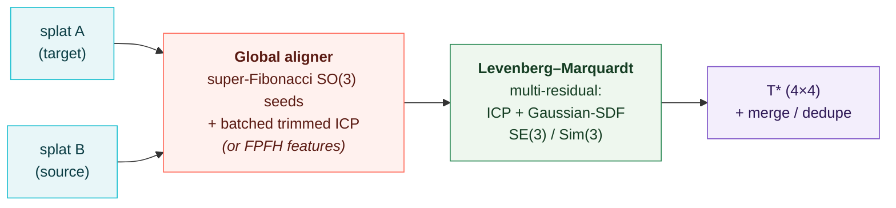

<div align="center">

# splatreg

### Register Gaussian splats — align & merge two 3DGS scans into one SE(3)/Sim(3) frame.

*The inverse of [gsplat](https://github.com/nerfstudio-project/gsplat): gsplat **renders** Gaussians, splatreg **registers** against them.* Pure PyTorch — no meshing, no CUDA extension, no point-cloud detour.

[](LICENSE)
[](pyproject.toml)
[](https://pytorch.org)
[](tests)
[](tests/test_jacobians.py)
[](RESULTS.md)


</div>

---

## What it is

A 3D Gaussian Splat is a cloud of oriented Gaussians that already traces an object's surface. **splatreg takes two such splats and finds the rigid (SE(3)) or similarity (Sim(3), +scale) transform that aligns them** — then optionally merges + dedupes them into one. It is the missing *registration* half of the Gaussian-splatting toolchain — the splat-to-splat alignment that SuperSplat / INRIA / geospatial users keep asking for, where today's tooling punts to a manual gizmo.

The pipeline is two stages:



1. **Global init** — a coarse pose from a dense super-Fibonacci rotation sweep + batched trimmed ICP (no local-minimum trap), with an optional **FPFH feature + RANSAC** path for harder cases.
2. **Refinement** — a from-scratch **Levenberg–Marquardt** core over a stack of residuals: classic **ICP** (point-to-point / point-to-plane) *and* splatreg's flagship **Gaussian-SDF** residual, solving the full SE(3) or Sim(3) tangent.

It **composes, it doesn't compete**: bring gsplat tensors directly; the LM loop and residual stack are pluggable.

### The differentiator — the Gaussian-SDF residual

No competitor packages this. splatreg derives a smooth, queryable **signed-distance field directly from the target Gaussians** — no mesh, no marching cubes — and drives registration by it:

```
w_i(p) = exp(−‖p − q_i‖² / 2σ²)              # Gaussian kernel weight per anchor
q̃(p)   = Σ w_i q_i / Σ w_i                    # kernel-weighted centroid
ñ(p)   = Σ w_i n_i / ‖Σ w_i n_i‖              # kernel-weighted surface normal
d(p)   = (p − q̃(p)) · ñ(p)                    # signed distance — the residual
```

`d(p)` vanishes exactly when the source points land on the target's surface. It has a **closed-form, audited Jacobian** (see below) and is a standalone, reusable implicit-field primitive: `gaussian_sdf(splat, points, sigma=...) → (sdf, normal)`.

---

## Install

```bash
git clone https://github.com/Archerkattri/splatreg.git
cd splatreg
pip install -e .          # pure PyTorch + numpy; pip install -e ".[test]" for the test extras
```

## Quickstart

```python
from splatreg.api import register, merge

# two Gaussian splats of the same object, in unknown relative pose/scale.
# register aligns `source` onto the reference `target` (target is the first arg).
result = register(target, source, transform="sim3")
print(result.T)         # recovered 4×4 similarity [[s·R, t], [0, 1]] — maps source -> target
print(result.scale)     # recovered scale s  (1.0 for transform="se3")
print(result.converged) # solver convergence flag

# register + dedupe a list of splats into one fused splat (registers internally)
fused = merge([source, target], transform="sim3")
```

The Gaussian-SDF field on its own:

```python
from splatreg.geometry.gaussian_sdf import gaussian_sdf, gaussian_sdf_grad
sdf, normal = gaussian_sdf(target, query_points, sigma=0.02)      # signed distance + surface normal
sdf, grad   = gaussian_sdf_grad(target, query_points, sigma=0.02) # signed distance + EXACT ∇_p d
```

---

## Validation & benchmarks

> splatreg is held to the validation bar of the libraries it sits beside — **gsplat / Theseus / GTSAM / SymForce**. Every number below is reproducible (commands at the bottom); the full record is in [`RESULTS.md`](RESULTS.md), the bar itself in [`docs/04_validation_roadmap.md`](docs/04_validation_roadmap.md).

### 1 · Synthetic recovery — the core accuracy test

Apply a *known* Sim(3)/SE(3) to a realistic object splat, recover it, measure the error. 3 seeds × {5°, 30°, 90°} × {0.8, 1.0, 1.3} scale (`examples/validate_recovery.py`).

| Block | Success | median rot | median trans | median scale err | median Chamfer |
|---|:---:|:---:|:---:|:---:|:---:|
| **SE(3)** (rigid) | **9 / 9 = 100%** | **0.000°** | 0.10 mm | — | 0.076 mm |
| **Sim(3)** (+scale) | **27 / 27 = 100%** | **0.259°** | 2.93 mm | 0.34% | 0.575 mm |
| **Overall** | **36 / 36 = 100%** | worst rot 0.43° | | | |

### 2 · Jacobian correctness — the audit that found a real bug

Every serious geometric-optimisation library checks each analytic Jacobian against a tangent-space numerical one. splatreg ships that audit (`tests/test_jacobians.py`, float64) **and a reusable `assert_residual_jacobian`** so every future residual gets it (the GTSAM `EXPECT_CORRECT_FACTOR_JACOBIANS` equivalent).

| Residual / op | Result |
|---|---|
| ICP point-to-point / point-to-plane | ✅ correct (max\|Δ\| ~3e-9 / 4e-11) |
| **Gaussian-SDF** | ✅ **closed-form exact** (~1e-8 vs numerical, in-support) |
| SE(3)/Sim(3) exp·log, group invariants, near-π, `so3_project` | ✅ all correct |

Two real bugs the audit caught and fixed:
- **SDF gradient.** The field returned the surface *normal* `ñ` as its gradient, but the true `∇d` carries a first-order `∂q̃/∂p` term (the kernel-weighted centroid moves with `p`) that `ñ` drops — a materially wrong pose gradient (`max|Δ|≈10.8`). Now an **exact closed-form gradient** (`gaussian_sdf_grad`): `∇d = ñ − (1/σ²)·Cov_w·ñ − (1/(σ²‖Sₙ‖))·Σᵢwᵢ(nᵢ·x)aᵢ`, with no autograd graph on the SE(3) path.
- **Near-π SO(3) log.** `se3_log` recovered the axis from the antisymmetric part `(R−Rᵀ)`, which vanishes at θ=π — losing the axis for ~180° rotations. Fixed with the standard robust branch (symmetric-part axis + `atan2`); roundtrip now exact to **~1e-13** across the interior.

### 3 · vs. plain ICP + residual ablation

`benchmarks/icp_baseline_bench.py` — identical recovery cells, splatreg vs ICP baselines.

| Method | SE(3) success | **Sim(3) success** |
|---|:---:|:---:|
| **splatreg (full)** | 9 / 9 | **27 / 27 = 100%** |
| ICP (centroid init) | 9 / 9 | 9 / 27 = 33% |
| ICP (super-Fib init) | 9 / 9 | 9 / 27 = 33% |

**splatreg wins Sim(3) decisively** — plain ICP cannot estimate scale, so it fails every non-unit-scale cell; the global init alone doesn't rescue it, so the **LM Sim(3) solve is load-bearing.** *Honest trade:* on rigid SE(3) both reach 100% and ICP is far faster — the SDF residual buys scale + implicit-field robustness at a real compute cost (see Limitations).

### 4 · Robustness sweep

`benchmarks/robustness_bench.py`, 3 seeds.

| Condition | Result |
|---|---|
| **Noise** (sensor jitter 0.5–2%) | ✅ **9 / 9 = 100%** (rot_err < 0.72°) |
| **Outliers** (+10–50% clutter) | ✅ **9 / 9 = 100%** (ignores clutter) |
| **Symmetric** (sphere) | ✅ **9 / 9 = 100%** with `init="features"` (8/9 with global init) |
| **Partial overlap** (20–60% removed) | ⚠️ **0 / 9** — partly *inherent*, see Limitations |

### 5 · Test suite + CI

`pytest tests/` → **30 passing**: the Jacobian audit, Lie-group ops (exp·log roundtrips, group invariants, hat/vee, near-π stability, a 10k-sample SymForce-style Jacobian sweep), and the LM solver (`CheckLinearError`, singular-system handling, GT recovery, Sim(3) scale). CI runs `black` + `mypy` + `pytest` (Python 3.10/3.11, CUDA-skip), with pre-commit and `py.typed`.

### 6 · Real-data benchmark — *GPU run pending* ⏳

The external anchor: the **GaussReg** protocol (ECCV 2024) on **ScanNet-GSReg** real splat pairs, plus the local **GaussianFeels**-tracker splats splatreg descends from.

| Benchmark | RRE | RTE | RSE | Success | Wall-time |
|---|:---:|:---:|:---:|:---:|:---:|
| ScanNet-GSReg vs HLoc+ICP | _pending_ | _pending_ | _pending_ | _pending_ | _pending_ |
| **SE(3) speed vs GaussianFeels tracker** | — | — | — | — | _pending_ |

> *splatreg derives from a real-time SE(3) Gaussian tracker, so speed is a first-class goal. The closed-form SDF gradient (above) is the correctness half of that work; the wall-time numbers land here once the GPUs free up.*

---

## Limitations (no overstating)

- **Partial overlap (0/9).** A genuinely hard problem (feature-method territory — TEASER++/Predator). Investigated in [`docs/03_failure_analysis.md`](docs/03_failure_analysis.md): the one-sided slab crop conflates *fixable* partial overlap with *inherently-ambiguous* partial overlap (the crop deletes the rotation-disambiguating feature → unrecoverable by **any** method, full FPFH included). A feature-based aligner (`align_features.py`, `init="features"`) is shipped and helps the symmetric case; large partial overlap is **WIP**. **`merge` is reliable for high-overlap captures.**
- **SE(3) speed.** The Gaussian-SDF residual costs more than nearest-neighbour ICP; the closed-form gradient + normal caching are landed, the full wall-time + truncation tuning are the GPU follow-up.

---

## Reproduce

```bash
pip install -e ".[test]"
python -m pytest tests/ -q                       # 30 passing: audit + Lie + solver
python tests/test_jacobians.py                   # the numerical-vs-analytic Jacobian audit
SPLATREG_DEVICE=cuda python examples/validate_recovery.py --device cuda   # recovery 36/36
SPLATREG_DEVICE=cuda python benchmarks/icp_baseline_bench.py --device cuda
SPLATREG_DEVICE=cuda python benchmarks/robustness_bench.py  --device cuda
python examples/make_readme_figure.py            # regenerate the hero figure
```

## Roadmap

- [ ] Real-data GaussReg / ScanNet-GSReg benchmark (RRE/RTE/RSE/success/time)
- [ ] SE(3) wall-time benchmark vs the GaussianFeels tracker + SDF truncation speed-ups
- [ ] Feature-based partial-overlap aligner to publication strength (FPFH + TEASER)
- [ ] 6-DoF object-pose mode + FoundationPose/YCB benchmark
- [ ] PyPI release

## License & layout

Apache-2.0. `splatreg/` — library (`api`, `align`, `align_features`, `core/lie`, `geometry/gaussian_sdf`, `residuals/`, `solvers/lm`). `tests/` · `benchmarks/` · `examples/` · `docs/` (`03` failure analysis, `04` validation roadmap). Full validation record: [`RESULTS.md`](RESULTS.md).
