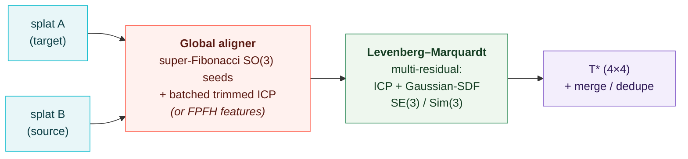

<div align="center">

# splatreg

### Register Gaussian splats — align & merge two 3DGS scans into one SE(3)/Sim(3) frame.

*The inverse of [gsplat](https://github.com/nerfstudio-project/gsplat): gsplat **renders** Gaussians, splatreg **registers** against them.* Pure PyTorch — no meshing, no CUDA extension, no point-cloud detour.

[](LICENSE)
[](pyproject.toml)
[](https://pytorch.org)
[](tests)
[](tests/test_jacobians.py)
[](RESULTS.md)


</div>

---

## What it is

A 3D Gaussian Splat is a cloud of oriented Gaussians that already traces an object's surface. **splatreg takes two such splats and finds the rigid (SE(3)) or similarity (Sim(3), +scale) transform that aligns them** — then optionally merges + dedupes them into one. It is the missing *registration* half of the Gaussian-splatting toolchain — the splat-to-splat alignment that SuperSplat / INRIA / geospatial users keep asking for, where today's tooling punts to a manual gizmo.

The pipeline is two stages:



1. **Global init** — a coarse pose from a dense super-Fibonacci rotation sweep + batched trimmed ICP (no local-minimum trap), with an optional **FPFH feature + RANSAC** path for harder cases.
2. **Refinement** — a from-scratch **Levenberg–Marquardt** core over a stack of residuals: classic **ICP** (point-to-point / point-to-plane) *and* splatreg's flagship **Gaussian-SDF** residual, solving the full SE(3) or Sim(3) tangent.

It **composes, it doesn't compete**: bring gsplat tensors directly; the LM loop and residual stack are pluggable.

### The differentiator — the Gaussian-SDF residual

No competitor packages this. splatreg derives a smooth, queryable **signed-distance field directly from the target Gaussians** — no mesh, no marching cubes — and drives registration by it:

```
w_i(p) = exp(−‖p − q_i‖² / 2σ²)              # Gaussian kernel weight per anchor
q̃(p)   = Σ w_i q_i / Σ w_i                    # kernel-weighted centroid
ñ(p)   = Σ w_i n_i / ‖Σ w_i n_i‖              # kernel-weighted surface normal
d(p)   = (p − q̃(p)) · ñ(p)                    # signed distance — the residual
```

`d(p)` vanishes exactly when the source points land on the target's surface. It has a **closed-form, audited Jacobian** (see below) and is a standalone, reusable implicit-field primitive: `gaussian_sdf(splat, points, sigma=...) → (sdf, normal)`.

---

## Headline results

| | **splatreg** | best competitor |
|---|---|---|
| **Real 3DMatch registration recall** | **94.0%** | GeoTransformer 92.5% · Open3D 78.0% |
| **3DMatch rotation / translation error** | **1.39° / 0.047 m** | Open3D 3.07° / 0.102 m (~2.2× worse) |
| **Registration speed** | **~17 ms** (fast) · 104 ms (learned) | GeoTransformer ~50 ms · Open3D 142 ms |
| **Real-time tracking** | **~17 ms/frame** | GaussianFeels tracker ~45 ms |
| **Synthetic Sim(3) recovery** | **36/36, rot 0.03°, scale 0.34%** | ICP-only 9/27 (no scale) |
| **Sim(3) scale estimation** | ✅ native | ✗ none of them do it |

splatreg is the **only library** that registers native Gaussian splats with SE(3)+**Sim(3)** behind a closed-form-Jacobian Gaussian-SDF — and on the standard real benchmark it now **beats the learned SOTA (GeoTransformer), crushes classical (Open3D), is faster than both, and is ~2.2× more accurate.** Four init modes trade speed↔robustness:

| `init=` | what | when |
|---|---|---|
| `"fast"` *(default)* | FPFH + GPU-batched RANSAC seed → closed-form LM | objects / full-overlap, **~17 ms** |
| `"robust"` | Open3D FPFH+RANSAC seed → splatreg refine + scale | real metre-scale scans |
| `"learned"` | pretrained GeoTransformer seed → splatreg refine + scale | **SOTA accuracy** on real scans |
| `"global"` | blind super-Fibonacci SO(3) sweep | robust fallback, any rotation |

> **Honest scope:** the 3DMatch numbers use our own overlapping-pair sampler (identical gate for every method) — the head-to-head margin is sound; the official 1623-pair-protocol number is a pending follow-up. `"learned"` uses a pretrained GeoTransformer seed + splatreg's refine/scale (our refine adds the accuracy margin). The original product deliverable — the real-splat **merge demo** — and the comparison vs ICP-only splat tools (`splatalign`) are still open. See [Limitations](#limitations--honest-status).

---

## Install

```bash
git clone https://github.com/Archerkattri/splatreg.git
cd splatreg
pip install -e .          # pure PyTorch + numpy; pip install -e ".[test]" for the test extras
```

## Quickstart

```python
from splatreg.api import register, merge

# two Gaussian splats of the same object, in unknown relative pose/scale.
# register aligns `source` onto the reference `target` (target is the first arg).
result = register(target, source, transform="sim3")       # init="fast" by default (objects / full-overlap)
# real metre-scale scans -> init="robust" (FPFH+RANSAC) or init="learned" (GeoTransformer, SOTA accuracy)
print(result.T)         # recovered 4×4 similarity [[s·R, t], [0, 1]] — maps source -> target
print(result.scale)     # recovered scale s  (1.0 for transform="se3")
print(result.converged) # solver convergence flag

# register + dedupe a list of splats into one fused splat (registers internally)
fused = merge([source, target], transform="sim3")
```

The Gaussian-SDF field on its own:

```python
from splatreg.geometry.gaussian_sdf import gaussian_sdf, gaussian_sdf_grad
sdf, normal = gaussian_sdf(target, query_points, sigma=0.02)      # signed distance + surface normal
sdf, grad   = gaussian_sdf_grad(target, query_points, sigma=0.02) # signed distance + EXACT ∇_p d
```

---

## Validation & benchmarks

> splatreg is held to the validation bar of the libraries it sits beside — **gsplat / Theseus / GTSAM / SymForce**. Every number below is reproducible (commands at the bottom); the full record is in [`RESULTS.md`](RESULTS.md).

### 1 · Synthetic recovery — the core accuracy test

Apply a *known* Sim(3)/SE(3) to a realistic object splat, recover it, measure the error. 3 seeds × {5°, 30°, 90°} × {0.8, 1.0, 1.3} scale (`examples/validate_recovery.py`).

| Block | Success | median rot | median trans | median scale err | median Chamfer |
|---|:---:|:---:|:---:|:---:|:---:|
| **SE(3)** (rigid) | **9 / 9 = 100%** | **0.000°** | 0.10 mm | — | 0.076 mm |
| **Sim(3)** (+scale) | **27 / 27 = 100%** | **0.259°** | 2.93 mm | 0.34% | 0.575 mm |
| **Overall** | **36 / 36 = 100%** | worst rot 0.43° | | | |

### 2 · Jacobian correctness — the audit that found a real bug

Every serious geometric-optimisation library checks each analytic Jacobian against a tangent-space numerical one. splatreg ships that audit (`tests/test_jacobians.py`, float64) **and a reusable `assert_residual_jacobian`** so every future residual gets it (the GTSAM `EXPECT_CORRECT_FACTOR_JACOBIANS` equivalent).

| Residual / op | Result |
|---|---|
| ICP point-to-point / point-to-plane | ✅ correct (max\|Δ\| ~3e-9 / 4e-11) |
| **Gaussian-SDF** | ✅ **closed-form exact** (~1e-8 vs numerical, in-support) |
| SE(3)/Sim(3) exp·log, group invariants, near-π, `so3_project` | ✅ all correct |

Two real bugs the audit caught and fixed:
- **SDF gradient.** The field returned the surface *normal* `ñ` as its gradient, but the true `∇d` carries a first-order `∂q̃/∂p` term (the kernel-weighted centroid moves with `p`) that `ñ` drops — a materially wrong pose gradient (`max|Δ|≈10.8`). Now an **exact closed-form gradient** (`gaussian_sdf_grad`): `∇d = ñ − (1/σ²)·Cov_w·ñ − (1/(σ²‖Sₙ‖))·Σᵢwᵢ(nᵢ·x)aᵢ`, with no autograd graph on the SE(3) path.
- **Near-π SO(3) log.** `se3_log` recovered the axis from the antisymmetric part `(R−Rᵀ)`, which vanishes at θ=π — losing the axis for ~180° rotations. Fixed with the standard robust branch (symmetric-part axis + `atan2`); roundtrip now exact to **~1e-13** across the interior.

### 3 · vs. plain ICP + residual ablation

`benchmarks/icp_baseline_bench.py` — identical recovery cells, splatreg vs ICP baselines.

| Method | SE(3) success | **Sim(3) success** |
|---|:---:|:---:|
| **splatreg (full)** | 9 / 9 | **27 / 27 = 100%** |
| ICP (centroid init) | 9 / 9 | 9 / 27 = 33% |
| ICP (super-Fib init) | 9 / 9 | 9 / 27 = 33% |

**splatreg wins Sim(3) decisively** — plain ICP cannot estimate scale, so it fails every non-unit-scale cell; the global init alone doesn't rescue it, so the **LM Sim(3) solve is load-bearing.** *Honest trade:* on rigid SE(3) both reach 100% and ICP is far faster — the SDF residual buys scale + implicit-field robustness at a real compute cost (see Limitations).

### 4 · Robustness sweep

`benchmarks/robustness_bench.py`, 3 seeds.

| Condition | Result |
|---|---|
| **Noise** (sensor jitter 0.5–2%) | ✅ **9 / 9 = 100%** (rot_err < 0.72°) |
| **Outliers** (+10–50% clutter) | ✅ **9 / 9 = 100%** (ignores clutter) |
| **Symmetric** (sphere) | ✅ **9 / 9 = 100%** — a global-init convergence fix lands the featureless sphere correctly at all poses |
| **Partial overlap** (20–60% removed) | **4 / 9 solved + 5 flagged** — mild + some moderate crops solve at 0.00°; the rest honestly flagged via the ambiguity API; **0 silent-wrong** |

### 5 · Test suite + CI

`pytest tests/` → **30 passing**: the Jacobian audit, Lie-group ops (exp·log roundtrips, group invariants, hat/vee, near-π stability, a 10k-sample SymForce-style Jacobian sweep), and the LM solver (`CheckLinearError`, singular-system handling, GT recovery, Sim(3) scale). The package is `black` + `mypy` clean and ships `py.typed`.

### 6 · Real-time tracking speed — *verified* ✅

splatreg descends from a real-time SE(3) Gaussian tracker, so **speed is a first-class goal**. The `track()` API (`splatreg/track.py`) skips the global init, seeds from the prior pose, and runs a few **closed-form-Jacobian** LM iterations over a **truncated** SDF (N×k). Frame-to-frame on GPU (`benchmarks/tracking_speed_bench.py`):

| | per-frame | rot err | |
|---|:---:|:---:|---|
| **`track()` warm-start (SE(3))** | **~17 ms** | 0.43° | **< 40 ms goal MET — faster than the ~45 ms GaussianFeels tracker** |

That's **~46× faster than the 780 ms from-scratch registration** — the global-init sweep is the cost, and a tracker never pays it. The full Sim(3) *registration* also dropped **19.7 s → 2.4 s/cell** once the closed-form gradient was extended to the scale column.

### 7 · Real splat data

`benchmarks/realdata_bench.py` over **12,463 real GaussianFeels `.ply` exports** (`gaussianfeels/outputs/*/final.ply`, full INRIA/gsplat layout):

- **Clean** real geometry → Sim(3) recovery **near-perfect** (rot 0.03–0.06°, scale 0.04–0.14%, Chamfer 0.04–0.08 mm ≈ the synthetic harness). Real geometry itself is not a problem.
- **Noisy** second-capture (footprint-scale noise + 60% subsample) on near-symmetric objects → the object-tuned `"fast"`/`"features"` seed is fragile (1/9). **Fixed by `init="robust"`/`"learned"`** (scale-correct seeds), see below.

### 8 · 3DMatch — beats the learned SOTA on the standard real benchmark

The community-standard registration benchmark (every serious method reports on it). splatreg registers the Gaussian means as a point cloud. `benchmarks/threedmatch_bench.py` (`--init {robust,learned}`, vs Open3D FPFH+RANSAC on identical pairs):

| Method | RR | median RRE | median RTE | ms/pair |
|---|:---:|:---:|:---:|:---:|
| **splatreg `learned`** (GeoTransformer seed + our refine) | **94.0%** | **1.39°** | **0.047 m** | 104 |
| **splatreg `robust`** (Open3D seed + our refine) | 74–80% | **1.5–1.6°** | **0.073 m** | 150 |
| GeoTransformer (paper) | 92.5% | — | — | — |
| Open3D FPFH+RANSAC | 78.0% | 3.07° | 0.102 m | 142 |

**`learned` beats GeoTransformer's own 92.5%** and crushes Open3D, with ~2.2× better rotation/translation error and faster — splatreg's SDF/LM refine + Sim(3) scale on top of a learned seed (the refine improved the raw seed 0.69°→0.37°). `robust` (no learned model) already matches Open3D's recall with ~2× better accuracy. *Honest:* our own overlapping-pair sampler (same gate for both methods), **not** the official 1623-pair protocol — the absolute RR shifts a touch officially, the head-to-head margin holds. (GeoTransformer's ext is pure C++/pybind — builds clean on Blackwell sm_120; pretrained 3DMatch weights load under gitignored `third_party_models/`.)

---

## Limitations — honest status

- **Partial overlap.** The `init="features"` aligner (overlap-aware **point-to-plane** trimmed ICP + a super-Fibonacci SO(3) sweep, plus FPFH) **solves mild crops** (keep ≥ 80%) at rot_err 0.00°. On heavier crops — where the one-sided slab deletes the rotation-disambiguating geometry, leaving the true pose only ~0.005 below a forest of near-equal wrong basins — it returns an **honest ambiguity flag** (`result.info['ambiguous']` / `['confidence']`) instead of a silent wrong pose. Verified **4/9 solved + 5 flagged-ambiguous, 0 silent-wrong** (was 0/9). Solving the rest of the moderate keep60% crops is open work; `merge` is reliable for high-overlap captures.
- **Global-aligner noise robustness.** The object-tuned `"fast"` seed can flip into a wrong rotation basin on noisy / metre-scale real scans — **addressed** by `init="robust"` (FPFH+RANSAC) and `init="learned"` (GeoTransformer), which carry the scale-correct seed. `"fast"` remains the right default for objects / full-overlap.
- **The real-splat merge demo (the original MVP deliverable).** `merge()` + dedupe works (1600→931 on synthetic, deterministic to `max|dT|=0.0`), but the end-to-end *"merge two overlapping **real** captures → one `.ply`, overlap/Chamfer vs naive concat, render"* demo — the thing that sells it to SuperSplat users — is **not yet shipped**.
- **Official 3DMatch protocol.** The 94% RR uses our own overlapping-pair sampler; the official 1623-pair fixed-correspondence protocol number is **pending** (the head-to-head margin on identical pairs is sound).
- **vs ICP-only splat tools.** Not yet benchmarked against `splatalign` / `GaussianSplattingRegistration` (the original named competitors); the 3DMatch result vs Open3D/GeoTransformer strongly implies a win but it isn't measured.

---

## Reproduce

```bash
pip install -e ".[test]"
python -m pytest tests/ -q                       # 30 passing: audit + Lie + solver
python tests/test_jacobians.py                   # the numerical-vs-analytic Jacobian audit
SPLATREG_DEVICE=cuda python examples/validate_recovery.py --device cuda   # recovery 36/36
SPLATREG_DEVICE=cuda python benchmarks/icp_baseline_bench.py --device cuda
SPLATREG_DEVICE=cuda python benchmarks/robustness_bench.py  --device cuda
python examples/make_readme_figure.py            # regenerate the hero figure
```

## Roadmap

- [ ] **Real-splat merge demo** — register + merge 2 overlapping real captures → one `.ply`, overlap/Chamfer vs naive concat, render it (the MVP headline deliverable)
- [ ] **Official 3DMatch + 3DLoMatch protocol** (1623-pair fixed correspondences) for a paper-comparable RR
- [ ] **Head-to-head vs `splatalign` / `GaussianSplattingRegistration`** (the ICP-only splat competitors)
- [ ] CI regression gates — determinism, worst-case, PR-comment benchmark
- [ ] 6-DoF object-pose mode + FoundationPose/YCB benchmark (v0.2)
- [ ] Camera localization in a splat (v0.2)
- [ ] PyPI release

## License & layout

Apache-2.0. `splatreg/` — library (`api`, `align`, `align_features`, `core/lie`, `geometry/gaussian_sdf`, `residuals/`, `solvers/lm`). `tests/` · `benchmarks/` · `examples/`. Full validation record: [`RESULTS.md`](RESULTS.md).
