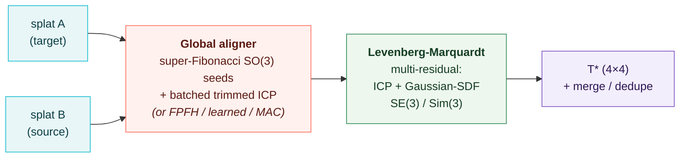

# splatreg

**Register Gaussian splats: align and merge 3DGS scans into one SE(3)/Sim(3) frame.**

gsplat *renders* your Gaussians; splatreg *registers* against them. It is the missing
registration half of the Gaussian-splatting toolchain: the splat-to-splat alignment that
SuperSplat / INRIA / geospatial users keep asking for, where today's tooling punts to a
manual gizmo.

- **Pure PyTorch**: no meshing, no CUDA extension, no point-cloud detour.
- **SE(3) and Sim(3)**: the only splat registrar that recovers **scale**.
- **Correct colour under rotation**: higher-order SH bands are Wigner-rotated with the
  splat (test-locked math, [PLY interop](ply-interop.md)).
- **Align with or without merging**: `merge` fuses + dedupes into one splat;
  `apply_transform` / `splatreg align` writes the source as its own registered PLY.
- **Pose covariance**: builtin-LM solves expose `info["information"]` /
  `info["covariance"]` for pose-graph weighting (`None` when singular, never faked).
- **Framework-agnostic**: gsplat, Nerfstudio/splatfacto, INRIA, SuperSplat, custom; anything
  that speaks the standard 3DGS PLY or hands over means/covariance tensors.
- **Honest diagnostics**: ambiguous overlaps are *flagged* (`info["ambiguous"]`,
  `info["confidence"]`), never silently wrong-posed.

## 30 seconds, end to end

```bash
pip install splatreg
splatreg align scan_a.ply scan_b.ply -o b_aligned.ply     # register + write aligned PLY
splatreg merge scan_a.ply scan_b.ply -o fused.ply          # register + fuse + dedupe
```

or in Python:

```python
from splatreg import register, merge, apply_transform
from splatreg.io import load_ply, save_ply

a = load_ply("scan_a.ply")          # target (stays fixed)
b = load_ply("scan_b.ply")          # source (gets aligned)

result = register(a, b, transform="sim3")   # init="fast" by default, ~17 ms
print(result.T)        # 4x4 similarity [[s*R, t], [0, 1]], maps source -> target
print(result.scale)    # recovered scale (1.0 for transform="se3")

fused = merge([a, b])               # register + concat + dedupe the overlap
save_ply(fused, "fused.ply")        # opens in SuperSplat / any 3DGS viewer

# or keep the scans separate, just registered into one frame:
save_ply(apply_transform(b, result.T, result.scale), "b_aligned.ply")
```

## How it works



1. **Global init**: a coarse pose from a dense super-Fibonacci rotation sweep + batched
   trimmed ICP (no local-minimum trap), with FPFH+RANSAC (`init="robust"`), learned
   GeoTransformer (`init="learned"`), and MAC maximal-clique (`init="mac"`) seeds for
   harder real scans. See [Init modes](init-modes.md).
2. **Refinement**: a from-scratch Levenberg-Marquardt core over ICP (point-to-point /
   point-to-plane) *and* splatreg's flagship **Gaussian-SDF** residual (a smooth signed
   distance field derived directly from the target Gaussians, with a closed-form, audited
   Jacobian), solving the full SE(3) or Sim(3) tangent and exposing the pose
   information/covariance at the optimum.

## Headline numbers

| | **splatreg** | reference |
|---|---|---|
| Real-splat merge (103k Gaussians) | Chamfer **10.3 → 2.0 mm (5.1×)**, overlap **0.03 → 0.67 (22×)** | naive concat |
| vs splat competitors (known GT Sim3) | **5.2°** | splatalign 15.3°, GS-Registration 36.3° |
| Sim(3) scale estimation | **native** | none of these do it |
| Official 3DMatch recall | **91.5%** mean | GeoTransformer ~92%, Open3D ~77% |
| Photometric refine (real rasterizer) | 5°/7 mm → **0.36°/0.5 mm** | geometric alone worsens the symmetric case |
| Registration speed | **~17 ms** (fast) | Open3D 142 ms |

Full record with reproduce commands: [Benchmarks](benchmarks.md).

## Where next

- [Quickstart](quickstart.md): install + the core workflows in Python.
- [CLI guide](cli.md): `splatreg align / merge / info` from the shell.
- [Init modes](init-modes.md): speed vs robustness, including `init="mac"` and the honest
  measured 3DMatch/3DLoMatch verdict.
- [Photometric refinement](photometric.md): the opt-in stage for poses geometry can't see
  (symmetry / texture-only DoF), with the measured when-and-why table, per-pair
  **exposure compensation** (default ON), and the **coarse-to-fine render ladder**.
- [PLY interop](ply-interop.md): splatfacto / INRIA / SuperSplat round-trip, and what
  happens to spherical harmonics under a recovered rotation (higher-order SH bands are
  **Wigner-rotated with the splat**; Ivanic-Ruedenberg, test-locked math).
- [API reference](api.md): every public function, autodoc'd.
